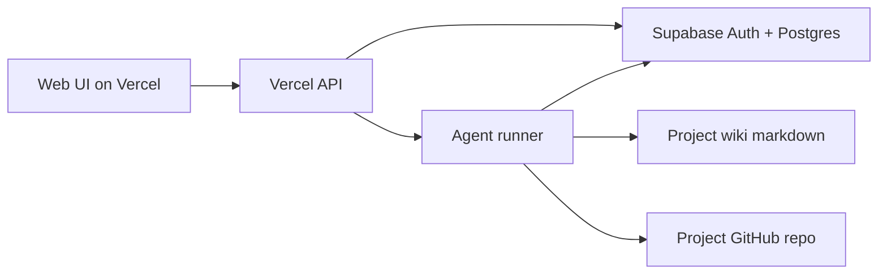

# Hosted Product Boundary

This project remains local-first while the product surface is being shaped. The
hosted version should preserve the same project-centered workflow instead of
reintroducing office, CRM, email, calendar, notification, or managed integration
state.

## Target Shape

The hosted architecture has three clear responsibilities:

- **Supabase Postgres/Auth** owns durable product records: users, teams,
  memberships, projects, project repo connections, tasks, delivery receipts, and
  a queryable index of project wiki pages.
- **Vercel web/API** owns the browser UI, auth session bridge, lightweight API
  routes, and product permissions. It should not run coding agents or hold
  long-lived worktrees.
- **Runner service** owns agent execution, git checkouts, branch creation, test
  commands, project wiki writes, and GitHub PR creation. The runner is the only
  component allowed to mutate source repositories.

## Product Rules

- Projects are the primary workspace unit after login.
- GitHub connections are optional and project-scoped.
- Before GitHub is ready, agents may plan, document, split tasks, and update the
  project wiki only.
- After GitHub is ready, coding tasks must create branch/PR evidence before they
  can be marked done.
- The project wiki remains the canonical memory surface. Hosted storage can index
  and sync it, but it must not replace it with CRM or integration memory.

## Data Split

| Domain | Hosted owner | Notes |
|---|---|---|
| Auth users and sessions | Supabase Auth | Replace local password/session logic before public hosting. |
| Teams and memberships | Supabase Postgres | Every project/task query is team-scoped. |
| Projects | Supabase Postgres | Includes optional repo URL and status. |
| Project repo readiness | Runner + GitHub CLI/App | API requests a fresh check; readiness is not a team-wide setting. |
| Tasks and receipts | Supabase Postgres | `delivery_url`, summary, and timestamps stay first-class. |
| Project wiki articles | Runner-owned markdown, DB-indexed | Markdown remains reviewable source of truth. |
| Agent execution logs | Runner storage, DB summaries | UI should show compact task progress, not raw logs by default. |

## Non-Goals For This Phase

- No hosted CRM, contacts, deals, email inbox, calendar, reminders, or generic
  notification center.
- No team-wide repository setting.
- No browser-executed coding agents.
- No long-running worktree state inside Vercel functions.
- No production billing or tenant-isolation implementation in the local MVP.

## Migration Order

1. Keep local APIs stable while projects, tasks, wiki, delivery receipts, and
   repo readiness are hardened.
2. Introduce Supabase tables that mirror the local contracts without changing the
   UI flow.
3. Move auth sessions to Supabase Auth and require team-scoped project/task
   queries.
4. Split agent execution into runner jobs while Vercel stays request/response.
5. Replace local `gh` readiness with project-scoped GitHub App installation
   checks.
6. Add PR creation and delivery receipt automation from the runner.

## Current Local Mapping

- `internal/team/broker.go` is the local API and state broker.
- `internal/team/project_wiki.go` and `internal/team/wiki_worker.go` define the
  current project memory contract.
- `internal/team/project_repo_readiness.go` is the local readiness adapter.
- `internal/team/runner_protocol.go`, `broker_runner.go`, and `runner_cli.go`
  define the hosted-style runner protocol and local CLI runner.
- `internal/team/worktree.go` is now runner-side infrastructure for project
  coding work.
- `api/[...path].js` is the Vercel/Supabase control-plane facade. It mirrors the
  local project/task/runner contracts without running agents in the API layer.
- `supabase/migrations/20260509_hosted_control_plane.sql` creates the hosted
  tables and RLS read boundaries.
- `web/src/components/apps/TasksApp.tsx` is the project workspace surface that
  should remain the hosted product's primary screen, including runner status.
