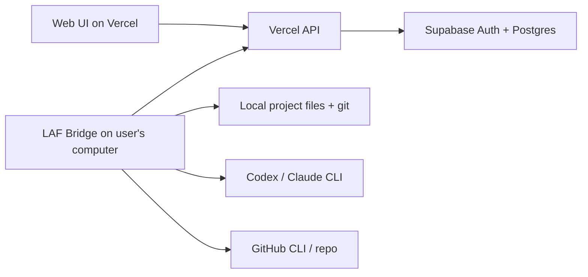

# Hosted Product Boundary

Status: Bridge-only hosted product boundary

## Target Shape

The hosted architecture has three responsibilities:

- **Supabase Postgres/Auth** owns durable product records: users, teams,
  memberships, projects, project repo connections, tasks, execution plans,
  execution receipts, delivery receipts, and queryable wiki indexes.
- **Vercel web/API** owns the browser UI, auth session bridge, lightweight API
  routes, and product permissions. It does not run coding agents or hold
  long-lived worktrees.
- **LAF Bridge** owns local execution: Codex/Claude CLI invocation, git
  operations, filesystem access, branch/PR work, heartbeats, job polling, log
  upload, and completion receipts. Bridge connects outbound to the hosted API.


```mermaid
flowchart LR
  Browser["Web UI on Vercel"] --> API["Vercel API"]
  API --> DB["Supabase Auth + Postgres"]
  Bridge["LAF Bridge on user's computer"] --> API
  Bridge --> Repo["Local project files + git"]
  Bridge --> CLI["Codex / Claude CLI"]
  Bridge --> GitHub["GitHub CLI / repo"]
```

## Product Rules

- Projects are the primary workspace unit after login.
- GitHub repo connections are project-scoped. A project can exist before a repo
  is connected, but project-scoped LAF Bridge execution requires the repo URL so
  Bridge can prepare a signed managed checkout on the paired computer.
- The browser and hosted API never execute local CLIs directly.
- A missing Bridge blocks only local CLI execution. Login, projects, tasks,
  memory, review queues, and unavailable-state UI still work.
- A connected Bridge surfaces device status and detected local CLI runtimes in
  Settings and project execution surfaces.

## Data Split

| Domain | Hosted owner | Notes |
|---|---|---|
| Auth users and sessions | Supabase Auth | Vercel routes validate membership on every browser request. |
| Teams and memberships | Supabase Postgres | Every project/task query is team-scoped. |
| Projects and tasks | Supabase Postgres | Project records include optional repo URL/status. |
| Bridge devices and pairing | Supabase Postgres | Tokens are stored only as hashes. |
| Execution plans/events/receipts | Supabase Postgres + Bridge uploads | Vercel stores state; Bridge performs work. |
| Local filesystem/git/CLI | LAF Bridge | Never owned by Vercel. |

## Non-Goals

- No browser-to-localhost execution dependency.
- No hosted CLI execution inside Vercel functions.
- No separate user-visible local execution product, installer, pairing flow, or
  status UI.
- No legacy local execution command or API onboarding surface.

## Distribution

Hosted onboarding presents a single command:

```sh
npx laf-bridge pair
```

The UI creates a short-lived setup code that the user pastes when the command
prompts for it. The npm package `laf-bridge` downloads the release `laf-bridge`
binary and runs the `pair` command. Pairing starts the Bridge loop by default,
so a new user does not need a separate start command.

## Current Mapping

- `api/[...path].js` is the Vercel/Supabase facade.
- `cmd/laf-bridge` is the local Bridge CLI.
- `internal/bridge` contains Bridge API, polling, capability detection, and
  provider execution helpers.
- `supabase/migrations/*bridge*` and `*execution*` migrations provide Bridge
  device, pairing, execution plan, event, and receipt tables.
- Older execution-queue database objects may remain for migration
  compatibility, but they are not product onboarding or hosted execution
  surface.
