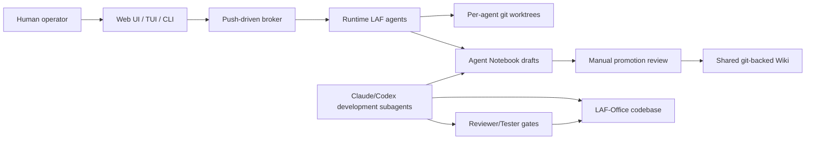

# LAF Meta AI Agent Company Architecture

LAF-Office has two layers:

1. Runtime company layer: LAF agents coordinate founder work through the broker,
   task boards, scoped MCP tools, per-agent worktrees, Notebook, and Wiki.
2. Development meta layer: Claude-powered or Codex-powered development
   subagents improve the LAF runtime itself.

## Runtime Company Layer

Runtime agents are concrete company teammates:

- CEO/lead agents route priority and resolve conflict.
- Product/planning agents define outcomes.
- Engineering agents implement.
- Review agents check quality and memory.
- Tester/QA agents verify.
- Ops agents maintain runtime and deployment.

They wake through the push-driven broker and work in isolated worktrees.

## Development Meta Layer

Development subagents are provider-neutral operating roles:

- Architect Agent designs changes to broker, provider, worktree, MCP, and wiki
  architecture.
- Coder Agent implements.
- Reviewer Agent reviews security, Office Rule, provider choice, and memory.
- Tester Agent verifies with tests and evals.
- Ops Agent maintains hooks, tmux/zellij, provider setup, and wiki sync.

Claude-powered mode loads `.claude/agents/*`. Codex-powered mode follows the
same contracts via `CLAUDE.md`, `AGENTS.md`, and `.laf-office/subagents/*`.

## Control Flow

## Boundaries

- The meta layer may edit the codebase and propose runtime improvements.
- The meta layer must not bypass runtime memory policy.
- The runtime layer must not depend on a Claude-only assumption.
- Both layers must keep Claude-powered and Codex-powered operation selectable.

## Done Definition

A meta-layer change is complete when it has:

- PR-ready diff.
- Reviewer result.
- Tester result.
- Provider neutrality check.
- Notebook capture recommendation.
- Wiki promotion candidate only when reviewed.

